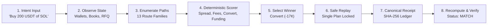

# Pathwise Hackathon Demo Recording Notes

## Video Specifications
- **Format**: MP4 (H.264 / AAC)
- **Resolution**: 1920 × 1080 (1080p Full HD)
- **Frame Rate**: 30.00 fps
- **Total Duration**: 02:55.000 (5,250 frames)
- **Hard Limit Compliance**: < 02:57.000 (strictly within the hackathon time ceiling)
- **Engine**: Remotion 4.x + Playwright 4K captures + Azure Neural Speech (en-US-GuyNeural)

---

## Recording Manifest & Source of Truth

| Field | Value | Evidence / Rationale |
| :--- | :--- | :--- |
| **Demo Environment** | `FIXTURE` (Synthetic Snapshot) | Accurately reflects fixture state; no fake live trades claimed |
| **App URL** | `http://localhost:3000` (Next.js 16.3.4) | Production-parity local workspace with live server-side verification |
| **Intent Evaluated** | `Buy 200 USDT of SOL, hold 24h` | Primary locked intent testing Spot, Convert, Transfers, and Funding |
| **Starting Pocket** | `SPOT` (USDT on Spot) vs `USDM` (USDT on USD-M) | Demonstrates pocket-aware routing and transfer leg scoring |
| **Baseline Route** | `Spot market` ($200.2346 all-in) | The standard taker benchmark against which all routes are scored |
| **Winning Route** | `Binance Convert` ($200.0646 all-in) | Selected purely by deterministic RFQ price advantage |
| **Cents Delta** | `−17.00¢` vs. Spot baseline | $200.0646 vs $200.2346 → 17¢ advantage |
| **Unsupported Routes** | 10 of 13 paths explicitly blocked | `PERP_DEPTH_UNAVAILABLE`, `FILL_NOT_GUARANTEED`, `WRONG_POCKET`, etc. |
| **Generated Receipt** | `rcpt-fixture-1` | Append-only ledger entry with full snapshot and route payload |
| **Verification State** | `MATCH` | Cryptographic SHA-256 canonical hash verification succeeded |
| **Campaign Evaluation** | 120 attempts / 6 ablations | 5 symbols (BTC, ETH, SOL, BNB, XRP), 3 notionals, 2 sides, 2 horizons |
| **Binance MCP Status** | `BLOCKED_BY_MCP` (`tools.json`) | Requires official OAuth with Agentic sub-account; zero fake live claims |

---

## Core Mechanism Demonstrated

---

## Deliverables Generated
1. **Rendered Demo Video**: `out/pathwise_demo_final.mp4`
2. **Winning Screenshot (Hero 1080p)**: `public/capture/hero_winning_screenshot_1080p.png`
3. **Voiceover Audio Tracks**: `public/audio/*.mp3` and `public/audio/manifest.json`
4. **Subtitles & Captions**:
   - `public/subtitles.srt` (SubRip format)
   - `public/subtitles.vtt` (WebVTT format)
   - `public/subtitles.json` (Structured JSON timestamps)
5. **Remotion Composition Source**: `src/video/Composition.tsx`, `src/video/Root.tsx`, `remotion.config.ts`
